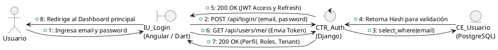
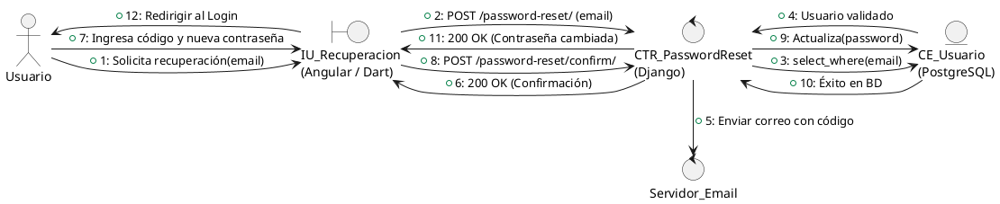
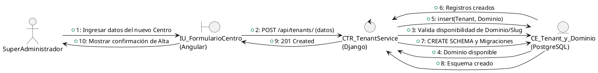
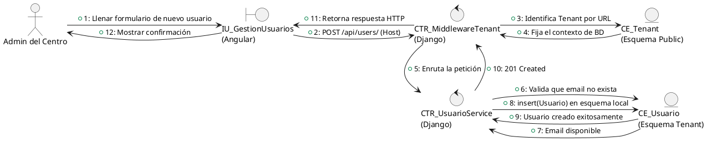
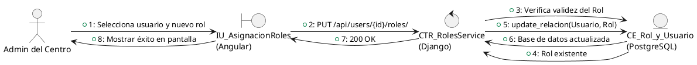

# Diagramas de Comunicación (UML) - Sprint 0

A continuación se presentan los diagramas de comunicación utilizando la notación visual requerida (Frontera, Control, Entidad), pero esta vez **especificando claramente a qué tecnología pertenece cada capa** y manteniendo **todos los pasos y flujos fluidos** de nuestra arquitectura real sin omitir detalles técnicos.

## Entorno Web y Móvil compartidos

### CU2 - Gestionar inicio de sesión y autenticación

### CU27 - Recuperar contraseña o credenciales de acceso

## Exclusivos del Entorno Web (Administración)

### CU1 - Gestionar centros psicológicos y configuración Multi-Tenant

### CU3 - Gestionar usuarios

### CU4 - Gestionar roles y permisos

