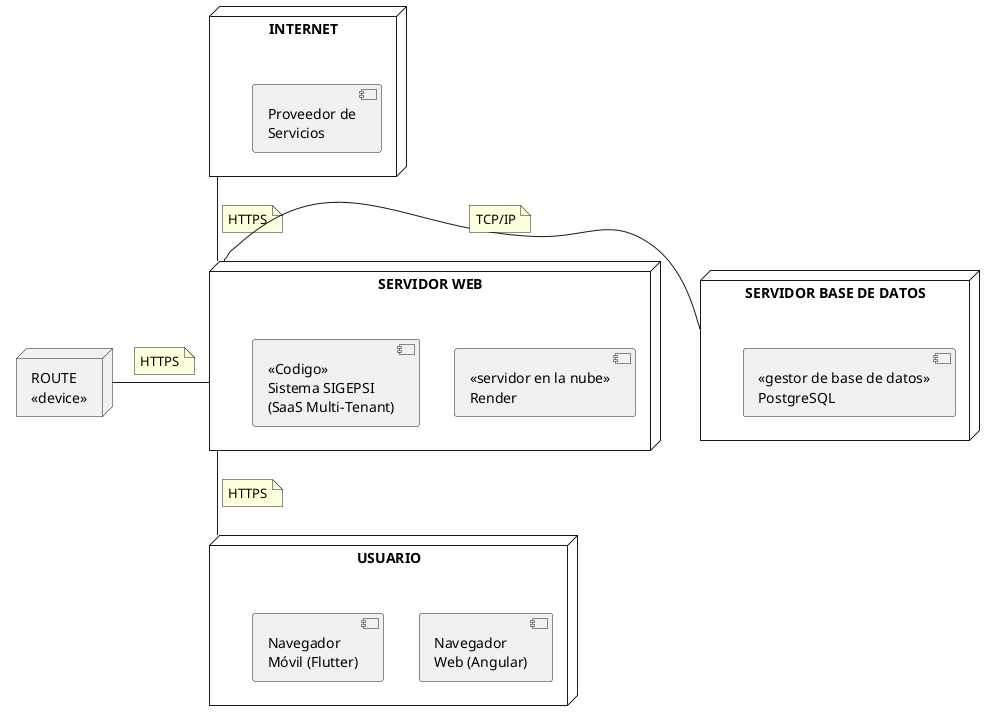
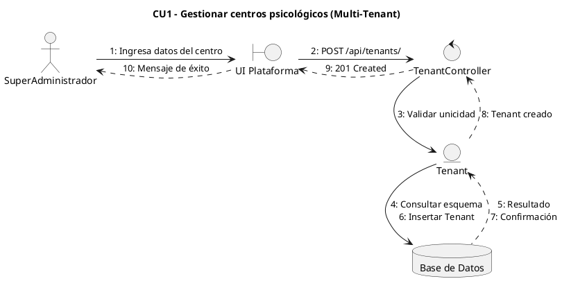
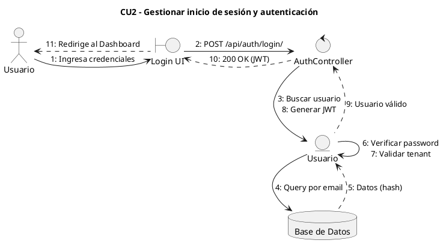
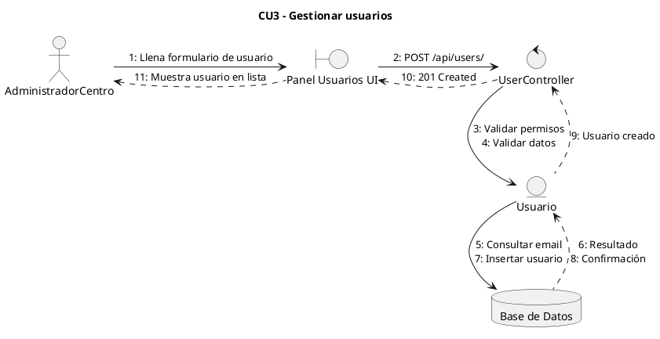
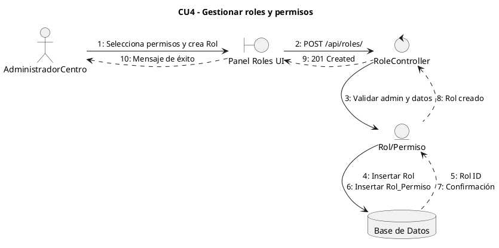
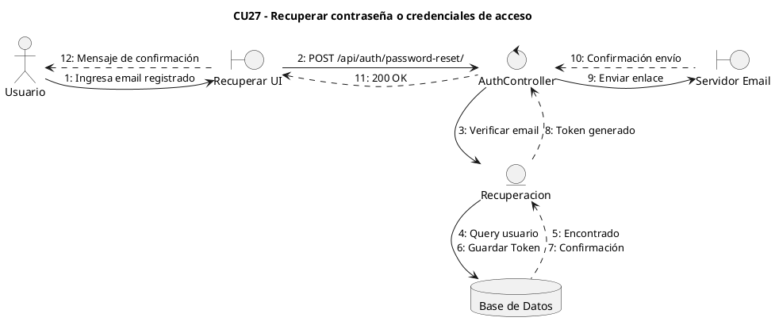
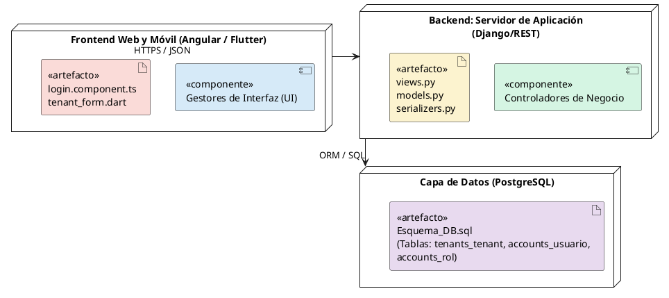
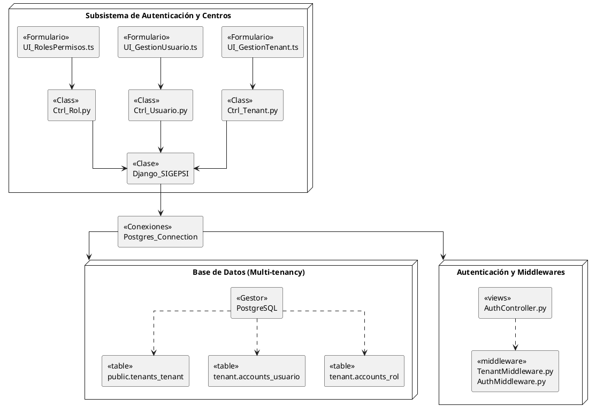

2. Proceso/patrón de desarrollo por Historia de Usuario 

| Rol | Integrante(s) |
|---|---|
| PRODUCT OWNER | Condori Diaz Marilyn Esther |
| SCRUM MASTER | Delgado Rojas Alberto Caleb |
| DEVELOPMENT TEAM | Mujica Vallejos Andy Mauricio; Velasco Soliz Rolando; Larrazabal Rojas Julio Cesar; Romero Saavedra Maria Ilse |


2.1 Diseño 
2.1.1 Diseño de la arquitectura 

El siguiente diagrama de despliegue ilustra la distribución de la arquitectura e infraestructura del sistema SIGEPSI:



2.1.2 Diseño de datos 
A continuación se presenta el script SQL de la base de datos para el Sprint 0, contemplando el esquema `public` para los datos compartidos (Multi-Tenant) y un esquema específico para los datos aislados de un centro:

```sql
-- ESQUEMA PUBLIC (Datos Compartidos de la Plataforma)
CREATE SCHEMA IF NOT EXISTS public;

-- Tabla para gestionar los centros psicológicos suscritos
CREATE TABLE public.tenants_tenant (
    id SERIAL PRIMARY KEY,
    nombre VARCHAR(255) NOT NULL,
    slug VARCHAR(50) UNIQUE NOT NULL,
    schema_name VARCHAR(63) UNIQUE NOT NULL,
    activo BOOLEAN DEFAULT TRUE,
    fecha_creacion TIMESTAMP DEFAULT CURRENT_TIMESTAMP
);

-- Dominios asociados a cada tenant
CREATE TABLE public.tenants_dominio (
    id SERIAL PRIMARY KEY,
    dominio VARCHAR(253) UNIQUE NOT NULL,
    tenant_id INTEGER REFERENCES public.tenants_tenant(id) ON DELETE CASCADE,
    es_primario BOOLEAN DEFAULT FALSE
);

-- Cuenta del SuperAdministrador de la plataforma
CREATE TABLE public.accounts_superadmin (
    id SERIAL PRIMARY KEY,
    email VARCHAR(255) UNIQUE NOT NULL,
    password VARCHAR(128) NOT NULL,
    nombre VARCHAR(100) NOT NULL,
    apellido VARCHAR(100) NOT NULL,
    activo BOOLEAN DEFAULT TRUE
);

-- =========================================================
-- ESQUEMA POR TENANT (Ejemplo para un centro específico 'centro_schema')
-- Este esquema se crea automáticamente al registrar un nuevo centro
CREATE SCHEMA IF NOT EXISTS centro_schema;

-- Roles del sistema dentro del centro
CREATE TABLE centro_schema.accounts_rol (
    id SERIAL PRIMARY KEY,
    nombre VARCHAR(50) UNIQUE NOT NULL,
    descripcion TEXT
);

-- Usuarios registrados del centro
CREATE TABLE centro_schema.accounts_usuario (
    id SERIAL PRIMARY KEY,
    email VARCHAR(255) UNIQUE NOT NULL,
    password VARCHAR(128) NOT NULL,
    nombre VARCHAR(100) NOT NULL,
    apellido VARCHAR(100) NOT NULL,
    telefono VARCHAR(20),
    rol_id INTEGER REFERENCES centro_schema.accounts_rol(id) ON DELETE SET NULL,
    activo BOOLEAN DEFAULT TRUE,
    fecha_creacion TIMESTAMP DEFAULT CURRENT_TIMESTAMP
);

-- Permisos individuales del sistema dentro del centro
CREATE TABLE centro_schema.accounts_permiso (
    id SERIAL PRIMARY KEY,
    nombre VARCHAR(100) NOT NULL,
    codigo VARCHAR(50) UNIQUE NOT NULL,
    descripcion TEXT
);

-- Relación muchos a muchos entre roles y permisos
CREATE TABLE centro_schema.accounts_rol_permiso (
    id SERIAL PRIMARY KEY,
    rol_id INTEGER REFERENCES centro_schema.accounts_rol(id) ON DELETE CASCADE,
    permiso_id INTEGER REFERENCES centro_schema.accounts_permiso(id) ON DELETE CASCADE,
    UNIQUE(rol_id, permiso_id)
);

-- Datos institucionales del centro psicológico
CREATE TABLE centro_schema.core_centro (
    id SERIAL PRIMARY KEY,
    nombre VARCHAR(255) NOT NULL,
    direccion TEXT,
    telefono VARCHAR(20),
    email VARCHAR(255),
    logo VARCHAR(255),
    horario_atencion TEXT,
    configuracion JSONB
);

-- Tokens temporales para la recuperación de contraseñas
CREATE TABLE centro_schema.accounts_token_recuperacion (
    id SERIAL PRIMARY KEY,
    usuario_id INTEGER REFERENCES centro_schema.accounts_usuario(id) ON DELETE CASCADE,
    token VARCHAR(255) UNIQUE NOT NULL,
    fecha_expiracion TIMESTAMP NOT NULL,
    usado BOOLEAN DEFAULT FALSE
);
```

2.1.3 Diseño de la lógica de negocio 
Diagramas de comunicación (colaboración) de los Casos de Uso del Sprint 0, incluyendo el CU27, diseñados formalmente con formato de comunicación:











2.2 Implementación 
2.2.1. Componentes y artefactos generados 

El siguiente diagrama ilustra los componentes y artefactos principales generados durante el Sprint 0, organizados por capas de sistema de acuerdo al diseño establecido:



2.2.1.2. Implementación de la arquitectura del subsistema

El siguiente diagrama de componentes ilustra cómo se interconectan los artefactos generados en la arquitectura del subsistema para el Sprint 0:



2.3 Pruebas 
2.3.1. Plan de pruebas (criterios de aceptación) 

Para el Sprint 0, el plan de pruebas se enfoca en validar la correcta creación del entorno Multi-Tenant, la seguridad en los accesos y la gestión básica de usuarios y roles. A continuación, se detallan los criterios de aceptación para los Casos de Uso desarrollados (CU1, CU2, CU3, CU4 y CU27):

| ID Prueba | Caso de Uso | Descripción de la Prueba | Criterios de Aceptación | Resultado Esperado |
|---|---|---|---|---|
| **PR-01** | CU1 - Gestionar centros | Registro de un nuevo centro psicológico (Tenant) | - Datos obligatorios completos.<br>- El slug de URL debe ser único en la plataforma. | El sistema crea un nuevo esquema aislado en PostgreSQL y retorna un HTTP 201. |
| **PR-02** | CU2 - Autenticación | Inicio de sesión de un usuario registrado | - Email y contraseña correctos.<br>- El usuario debe pertenecer al tenant especificado. | El sistema valida las credenciales y devuelve un token JWT válido (HTTP 200). |
| **PR-03** | CU3 - Gestionar usuarios | Creación de un usuario interno para el centro | - Petición autorizada con JWT de Administrador.<br>- Email no debe existir en el mismo tenant. | Usuario insertado exitosamente en el esquema del centro (HTTP 201). |
| **PR-04** | CU4 - Gestionar roles | Creación de rol y asignación de permisos | - Nombre del rol único.<br>- Seleccionar al menos un permiso de la lista. | Se registra el rol y se crean las relaciones en `accounts_rol_permiso` (HTTP 201). |
| **PR-05** | CU27 - Recuperar contraseña | Solicitud de recuperación mediante email | - El email ingresado debe existir en la base de datos del tenant. | Se genera un token de seguridad temporal y se simula el envío del correo electrónico con el enlace (HTTP 200). |

2.3.2 Reporte de prueba

El reporte de pruebas evidencia los resultados de la ejecución de los casos definidos en el entorno de desarrollo para validar la correcta integración del backend (Django) y frontend (Angular/Flutter).

| ID Prueba | Fecha de Ejecución | Entorno de Prueba | Estado | Observaciones / Notas Técnicas |
|---|---|---|---|---|
| **PR-01** | 22/08/2026 | Desarrollo (Postman / Local) | ✅ Exitoso | El middleware enruta correctamente las peticiones al nuevo esquema de la base de datos. |
| **PR-02** | 22/08/2026 | Desarrollo (Angular / Local) | ✅ Exitoso | El JWT se genera correctamente incluyendo el `tenant_id` y `rol_id` en el Payload. |
| **PR-03** | 22/08/2026 | Desarrollo (Angular / Local) | ✅ Exitoso | Las validaciones de aislamiento funcionan; permite usar el mismo email en diferentes tenants sin choque. |
| **PR-04** | 22/08/2026 | Desarrollo (Angular / Local) | ✅ Exitoso | Las relaciones de permisos se mapean correctamente y el frontend recibe la lista estructurada. |
| **PR-05** | 22/08/2026 | Desarrollo (Postman / Local) | ✅ Exitoso | El token se guarda en la tabla `accounts_token_recuperacion` con estado `usado = FALSE`. El correo de prueba se visualiza en la consola del servidor de Django. |